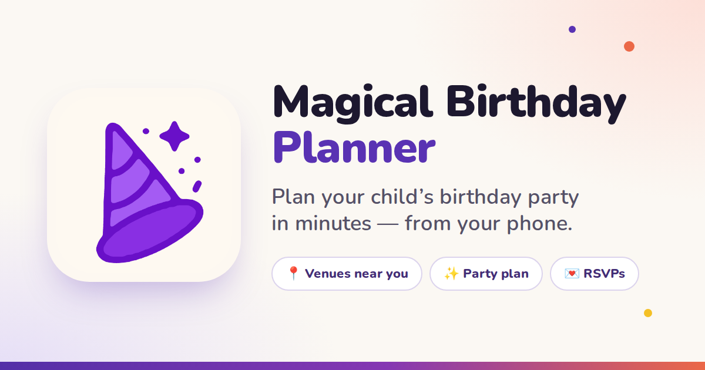
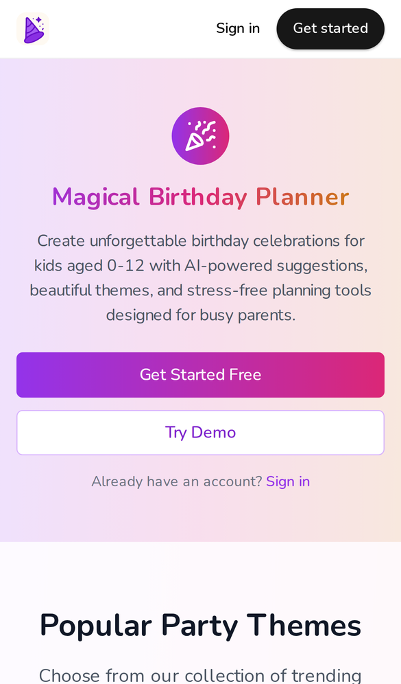
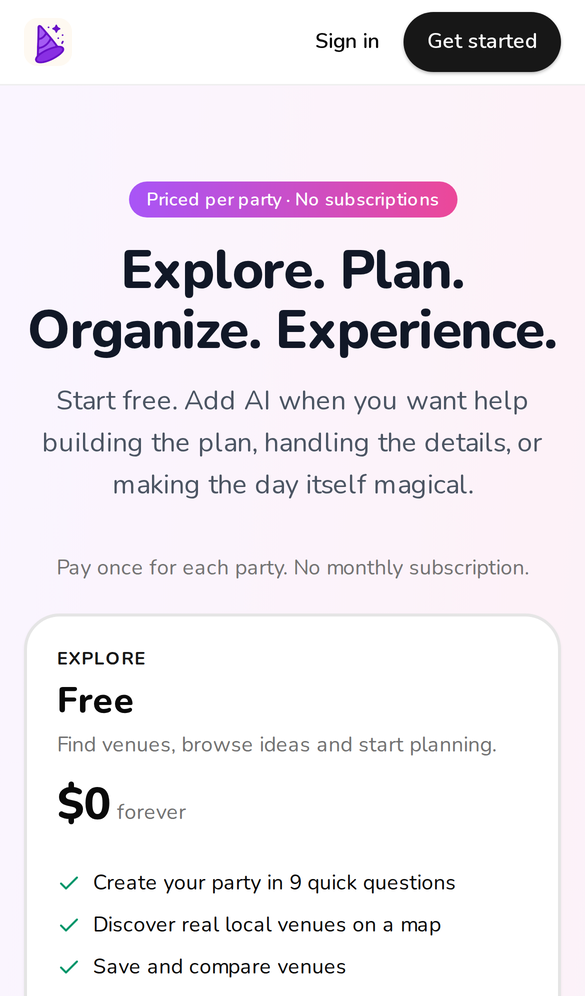
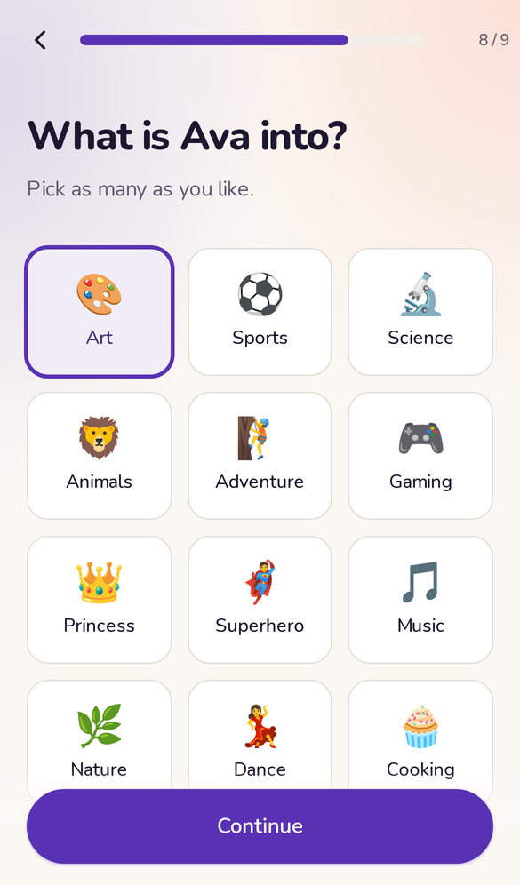
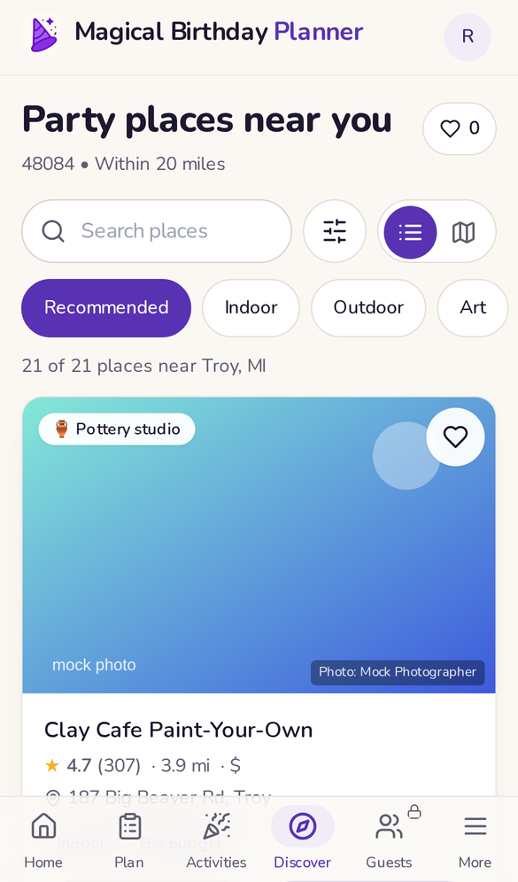
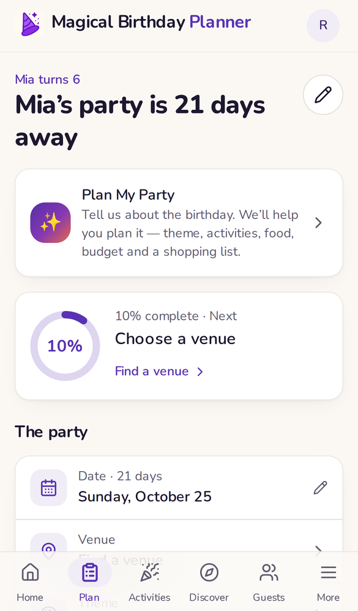
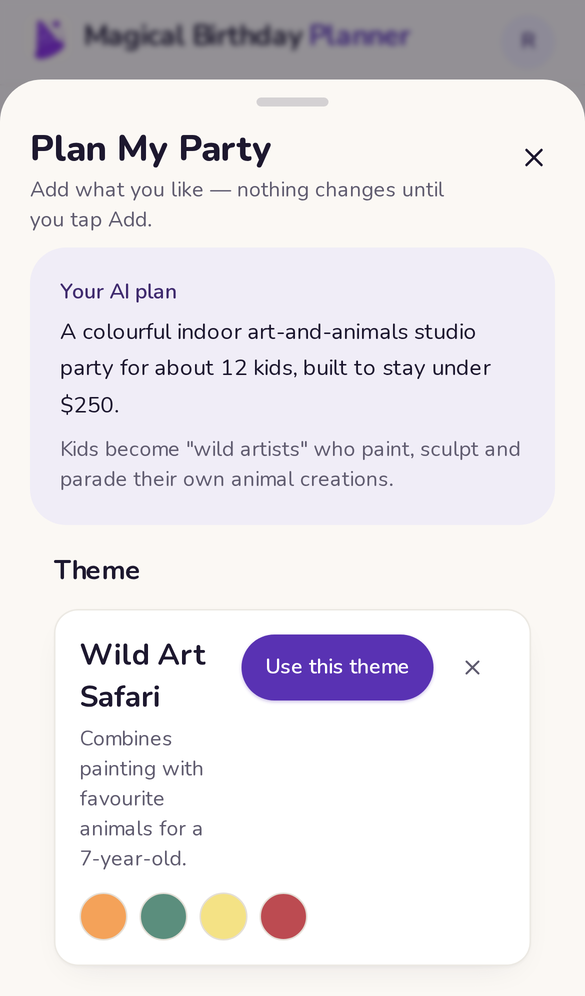
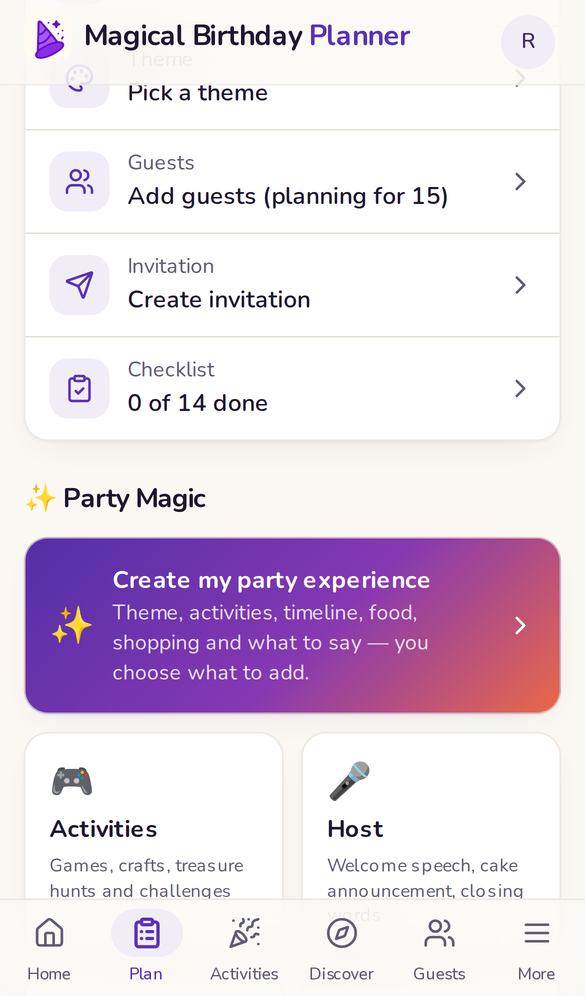
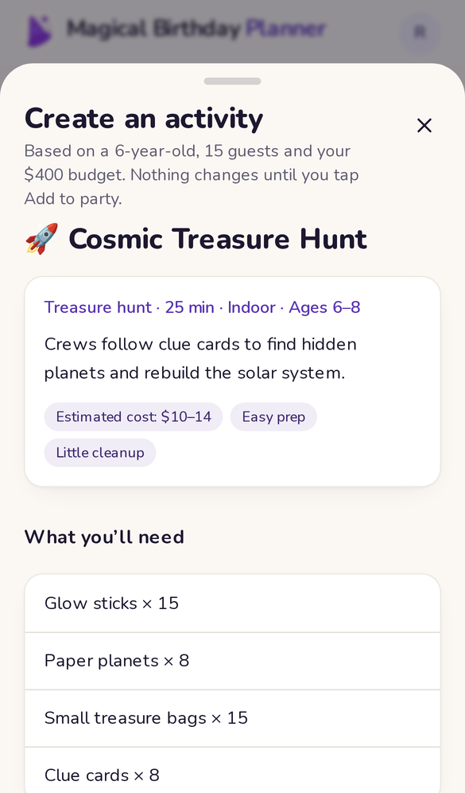
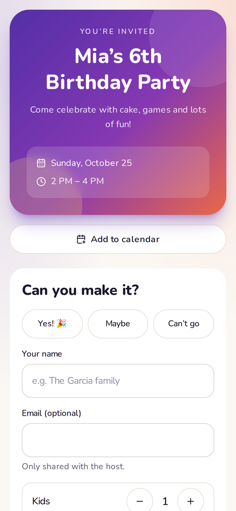

# Magical Birthday Planner

**An AI-powered birthday party planning platform that helps busy parents discover venues, organize guests, plan
activities, manage food and budgets, create invitations, and create a magical party experience.**

> **Private repository. v1.0 launch baseline — production, frozen.** Production: <https://magicalbirthdayplanner.app>.
> Never commit secrets — see [Security model](#security-model) and [`.env.example`](.env.example).
> New agents start here, then read [docs/AI_AGENT_HANDOFF.md](docs/AI_AGENT_HANDOFF.md).



---

## Contents

- [Product overview](#product-overview)
- [Product screenshots](#product-screenshots)
- [Current product features](#current-product-features)
- [Pricing & product model](#pricing--product-model)
- [AI architecture](#ai-architecture)
- [External integrations](#external-integrations)
- [Authentication](#authentication)
- [Security model](#security-model)
- [Observability](#observability)
- [Database](#database)
- [Repository structure](#repository-structure)
- [Local development](#local-development)
- [Testing](#testing)
- [Deployment](#deployment)
- [Launch status & documentation map](#launch-status--documentation-map)

---

## Product overview

**Who it's for.** Busy parents planning a child's birthday party.

**The problem.** Planning a party means juggling a venue, a theme, activities, the guest list, invitations and
RSVPs, food, a budget, shopping, a timeline, a checklist — and then actually running the day. Parents usually do this
across web searches, Pinterest boards, chat threads, spreadsheets and notes.

**What MBP does.** It puts the whole party in **one mobile-first app** (an installable PWA). A parent answers a few
quick questions about the child and the party, gets real local venues matched to the child, and plans everything in
one place. An **AI planning assistant** works *inside* that plan: it reads the party's real context (age, guest
count, budget, theme, venue, RSVPs) and returns structured suggestions the parent can add with one tap. It is not a
free-form chatbot, and nothing it writes is sent to anyone automatically.

**Product philosophy.** Useful for free (venue discovery, checklist, themes, your own plan); pay per party only when
you want guests & RSVP and AI help. The server — never the browser — decides what each party may do.

**Launch status.** Live in production with live Dodo payments (no real customer payments processed yet at the time
of the v1.0 baseline). See [docs/LAUNCH_BASELINE.md](docs/LAUNCH_BASELINE.md).

## Product screenshots

Real screenshots of the product. Public pages were captured from production; in-app screens from the local test
environment (mock Google/AI data, test accounts only — no real user data). All 42 are in
[docs/screenshots/](docs/screenshots/README.md).

| Homepage | Pricing (per party) | Party creation |
|---|---|---|
|  |  |  |

| Venue discovery | Party plan | AI — Plan My Party |
|---|---|---|
|  |  |  |

| AI — Party Magic hub | Activity Studio | Guest RSVP page |
|---|---|---|
|  |  |  |

## Current product features

Everything below exists in the code and is enabled in production unless marked otherwise. Per-feature detail:
[docs/FEATURES.md](docs/FEATURES.md).

### Party creation
- **Wizard** (`/start`, 9 steps with a summary): child's name, age, party date, ZIP/location (offline ZIP dataset,
  Google geocoding fallback), guest count, budget, vibe (indoor / outdoor / either), interests, optional theme.
  Optional steps can be skipped ("Skip for now").
- Multiple parties per account; edit details later; the active party is chosen in More.

### Discovery
- **Google Places (New)** venue search around the party ZIP, ranked for the child's age, interests, budget, setting and
  distance; filters; cache-first (shared venue store + search cache) with cost guards.
- **Google Map** (Maps JavaScript API) with clustered markers and a bottom sheet; schematic fallback without a key.
- **Venue details** (`/venue/[placeId]`): photos, rating, address, hours, phone, website, directions, "why we
  recommend it".
- **Saved venues** (`/discover/saved`): shortlist with private notes and compare; pick one as the party venue.

### Party planning
- **Party plan** (`/plan`): progress ring, next step, party details, venue, theme, "Your party plan" sections
  (activities, timeline, shopping, budget, menu, host lines).
- **Checklist** (`/plan/checklist`): dated tasks generated from the party date; milestones complete automatically.
- **Curated themes** (`/plan/theme`): catalogue with search, categories and "Recommended for <child>".
- **Activities** (`/activities`): planned activities with duration, materials, cost and how-to; add your own (Free).
- **Budget tracking**: planned vs. party budget, actual spend entered by the parent.

### Guests & RSVP (Starter+, and during the 24 h sign-up trial)
- **Guests** (`/guests`): add/edit/remove, kids/adults counts, notes, RSVP status filters, headcount summary.
- **Invitation** (`/plan/invite`): designed card (3 designs), share link / text / email / copy, reset link,
  **emailed invitations** via Resend (daily caps).
- **Public RSVP page** (`/invite/[token]`, no account): Yes / Maybe / Can't go, kids/adults, note, calendar file.
- **RSVP changes & duplicate protection**: one invitee = one guest row. Identity is a per-device respondent key
  (hashed) or the email — never the name. Changing a reply updates it; "RSVP for someone else" starts fresh on a shared
  phone; the previous name is pre-filled as a convenience only.
- **Notifications**: host notification + guest confirmation emails, once per real change.
- Enforced in the database: `guests` / `party_invitations` writes require paid access **for that party**
  (`has_paid_access(party)`); a Free/downgraded party keeps read/delete and existing links keep collecting RSVPs.

### AI features
13 AI feature ids exist (`lib/ai/types.ts`); **11 are sold and enabled in production**. Every AI request uses one
request from the party's allowance (failures count toward the per-user and global limits, not the party allowance);
**reopening a stored result is free**.

| AI feature | Feature id | Plan | Production | Where |
|---|---|---|---|---|
| Plan My Party | `party_planner` | Starter | enabled | Home / Plan → "Plan My Party" |
| AI Theme Ideas | `theme_ideas` | Starter | enabled | Plan → Theme |
| AI Checklist ("What am I forgetting?") | `checklist` | Starter | enabled | Plan → Checklist |
| Activity Studio (create + personalise) | `activity_studio` | Starter | enabled | Activities |
| Food Planner | `food` | Plus | enabled | Plan → Party Magic → Food |
| Budget Assistant | `budget_optimizer` | Plus | enabled | Party Magic → Budget |
| Invitation Writer | `invitation` | Plus | enabled | Invitation → "Write it for me" |
| Party-day Timeline | `timeline` | Plus | enabled | Party Magic → Timeline |
| Shopping List | `shopping_list` | Plus | enabled | Party Magic → Shopping |
| Party Host — welcome, activity intros, cake moment, closing, thank-yous (all / per guest), reminder | `host_content` | Pro | enabled | Party Magic → Host / Messages; activity detail |
| Party Experience (theme, activities, timeline, food, shopping, what to say — together) | `party_experience` | Pro | enabled | Party Magic → "Create my party experience" |
| Activity list (legacy, superseded by Activity Studio) | `activities` | Starter | **not enabled, not sold** | — |
| "Why these places" | `discover_explain` | Plus | **not enabled, not sold** | — |

Known limitations (latency, budget reasoning, etc.): [docs/KNOWN_LIMITATIONS.md](docs/KNOWN_LIMITATIONS.md).
Full AI documentation: [docs/ai/AI_FEATURES.md](docs/ai/AI_FEATURES.md).

### Account, billing, admin, platform
- **Account** (More): parties, plan for the active party, notifications, install, sign out.
- **Billing**: Dodo hosted checkout per party, verified webhooks, checkout success page that names the party.
- **Super Admin** (`/admin`): user search, account-wide plan overrides with audit log, stats incl. unresolved
  payments. Non-admins get 404.
- **Public pages**: `/`, `/pricing`, `/help`, `/privacy`, `/terms`, `/checkout-success`; Open Graph image.
- **PWA / mobile**: installable, offline shell, bottom navigation, 44 px tap targets, tested at 375 / 390 / 393 / 430 px.
- **First-party analytics** (`analytics_events`): funnel events, no PII.

## Pricing & product model

Source of truth: [`lib/entitlements.ts`](lib/entitlements.ts) (plans, capability → minimum plan, prices).
Dodo product ids and prices are unchanged since launch.

> **Paid plans are priced and enforced PER PARTY** (since 2026-10-04, migration `20251004001400`). Each purchase is a
> single payment (no subscription) that unlocks its plan **for the one party it was bought for**. Another party needs
> its own purchase. (Earlier drafts described account-wide purchases; that is **not** the current implementation.)

| Plan | Price | What it adds |
|---|---|---|
| **Free** — "Explore" | $0 forever | Create parties, venue discovery + map + details, saved venues, dated checklist, curated themes, party plan, your own activities. No guests/RSVP, no AI. |
| **Starter** — "Plan" | **$4.99 per party** | + Guests & RSVP (link, emailed invitations, RSVP collection) · Plan My Party · AI Theme Ideas · AI Checklist · Activity Studio · 10 AI requests per party |
| **Plus** — "Organize" | **$9.99 per party** | + Food Planner · Budget Assistant · Invitation Writer · Timeline · Shopping List · 25 AI requests per party |
| **Pro** — "Experience" | **$14.99 per party** | + Party Host (welcome, activity intros, cake, closing, thank-you & reminder messages) · Party Experience · 50 AI requests per party |

| Feature | Free | Starter | Plus | Pro |
|---|:-:|:-:|:-:|:-:|
| Create parties, wizard | ✓ | ✓ | ✓ | ✓ |
| Venue discovery, map, venue details | ✓ | ✓ | ✓ | ✓ |
| Saved venues & notes | ✓ | ✓ | ✓ | ✓ |
| Dated checklist | ✓ | ✓ | ✓ | ✓ |
| Curated themes | ✓ | ✓ | ✓ | ✓ |
| Party plan, your own activities, budget tracking | ✓ | ✓ | ✓ | ✓ |
| Guests | – | ✓ | ✓ | ✓ |
| Invitations & RSVP (link + email) | – | ✓ | ✓ | ✓ |
| Plan My Party · AI Theme Ideas · AI Checklist · Activity Studio | – | ✓ | ✓ | ✓ |
| Food Planner · Budget Assistant · Invitation Writer · Timeline · Shopping List | – | – | ✓ | ✓ |
| Party Host (incl. thank-you & reminder messages) · Party Experience | – | – | – | ✓ |
| AI requests per party | 0 | 10 | 25 | 50 |

**Rules (as implemented):**
- **Entitlement precedence for a party:** admin override (account-wide) → that party's purchase (best active plan) →
  24 h sign-up trial → Free. Legacy pre-2026-10-04 account-wide purchases are still honoured in code (production has none).
- **Trial:** every new account gets 24 h of Starter's **non-AI** features (guests & RSVP) on all its parties; **no AI**.
- **Upgrade:** buy a higher plan for the same party (full price of that plan; no proration). A party cannot buy a plan
  it already has or exceeds (`409 already_owned`).
- **Downgrade / refund:** no automatic downgrade. A refund ends that party's plan; data stays (guests readable and
  deletable, shared RSVP links keep working), paid features lock again. Deleting a party ends its plan.
- **AI limits:** per party 10 / 25 / 50; per user 10 per hour and `AI_USER_DAILY_LIMIT` (10) per rolling 24 h; global
  breaker `AI_GLOBAL_DAILY_LIMIT` (50) per UTC day. Super Admin bypasses plan and per-party/user caps (not the global breaker).
- **Unmatched payments** (a paid webhook that can't be verifiably tied to a party) unlock **nothing**, raise a Sentry
  `PAYMENT_UNRESOLVED` warning, show in Super Admin stats and are fixed with `public.reconcile_purchase(purchase, party)`.

Details and the full audit: [docs/PRODUCT_MODEL_AUDIT.md](docs/PRODUCT_MODEL_AUDIT.md),
[docs/BILLING_SECURITY.md](docs/BILLING_SECURITY.md).

## AI architecture

Every AI feature is a route under `app/api/ai/*` built by one factory, `createAIRoute()` in
[`lib/ai/handler.ts`](lib/ai/handler.ts):

```
User (browser, Bearer JWT)
 → POST /api/ai/<feature>
 → 1  authenticate (Supabase JWT)                          401 otherwise
 → 2  strict body validation (zod, 16 KB cap)              400
 → 3  party ownership (user's own RLS session)             404 for someone else's party
 → 4  feature flag (AI_ENABLED + AI_ENABLED_FEATURES)      503 ai_disabled
 → 5  entitlement: getPartyPlan → tier → planAllows        403 forbidden_plan + upgradeTo
 → 6  reservation: reserveGeneration → ai_reserve (service role only; global breaker checked atomically)
      then rank-based caps: per party / per user per hour / per user per day   429 limit_reached
 → 7  party context: buildPartyAIContext (no surnames, emails, phones, addresses, ZIP, tokens)
 → 8  model call: callStructured (lib/ai/client.ts) — timeout, ≤1 repair retry, JSON schema (zod) validation,
      safety scrub; long features use AI_LONG_TIMEOUT_MS
 → 9  server post-processing (ids, recomputed totals, clamped dates, allergen-claim scrub, clock times)
 → 10 finalize: ai_finalize (service role) — success/failed/rejected, tokens, duration, result persisted
 → 11 telemetry: gen_ai.chat span + AI_* metrics in Sentry (metadata only)
 → parent reviews → "Add"/"Use" → POST /api/ai/apply copies the chosen item from the STORED result into party tables
```

- **Provider:** OpenAI-compatible abstraction (`lib/ai/provider.ts`, `lib/ai/providers/*`). Production:
  `AI_PROVIDER=opencode` (OpenCode Go), `AI_MODEL=deepseek-v4-pro`, reasoning off (`AI_THINKING=off`),
  `AI_TIMEOUT_MS=45000`, long timeout 55 s (default), `AI_MAX_OUTPUT_TOKENS=3000`, `AI_MAX_RETRIES=1`. Tests use
  `AI_PROVIDER=mock` (deterministic fixtures).
- **Usage accounting** (`lib/ai/usage.ts`, table `ai_generations`): reservation is server-only; usage survives party
  and account deletion (rows are anonymised, not deleted); clients cannot finalize or reset usage.
- **Results persist** per party; reopening restores the last result with no new request; "Refresh with your new party
  details" appears when the party changed.
- **Privacy:** prompts and outputs are not sent to Sentry; only metadata. Parent free text is wrapped as data
  (prompt-injection resistant). Full details: [docs/ai/AI_FEATURES.md](docs/ai/AI_FEATURES.md).

## External integrations

| Integration | Purpose | Notes |
|---|---|---|
| **Supabase** | Auth (email/password, Google), PostgreSQL, RLS, RPCs, migrations, persistence | anon key public; service role server-only |
| **Google Places API (New) / Maps JS / Geocoding** | Venue discovery, details, photos, map, ZIP fallback | server key (Places) vs. separate referrer-restricted browser key (Maps); cost guards ([GOOGLE_PLACES_COST_CONTROL](docs/GOOGLE_PLACES_COST_CONTROL.md)) |
| **Dodo Payments** (live mode) | Hosted checkout for Starter $4.99 / Plus $9.99 / Pro $14.99 **per party** (one-time products), signed webhooks → `billing_purchases` → party entitlement | server picks product + price; Standard Webhooks HMAC; product ids in env |
| **Sentry** | Errors, tracing, logs, metrics, AI monitoring, billing/auth/Google telemetry, uptime on `/api/health`, alerts | DSN public; auth token build-only |
| **Resend** | Invitation emails, RSVP confirmations, host notifications | sender `noreply@magicalbirthdayplanner.app` |
| **OpenCode (AI provider)** | All AI features | `AI_API_KEY` server-only |
| **Vercel** | Hosting, production deploys from `master`, env configuration | project `magical-birthday-planner-1754362591587` |
| **GitHub** | Private source of truth, launch tag `v1.0.0` | repository must remain **private** |
| Cloudflare | DNS only (no proxy) | |

More: [docs/INTEGRATIONS.md](docs/INTEGRATIONS.md) · variables: [docs/ENVIRONMENT_VARIABLES.md](docs/ENVIRONMENT_VARIABLES.md).

## Authentication

- **Supabase Auth**: email + password (email confirmation), password reset (`/reset-password`), Google OAuth
  (`/auth/callback`). Sessions live in the browser (Supabase client); API routes require `Authorization: Bearer <JWT>`
  and query **as the user**, so RLS applies (`lib/server/auth.ts`).
- **Protected routes**: the signed-in app (`app/(app)`, wizard) redirects to `/login?next=…` without a session
  (`components/app/AppShell.tsx`); private pages carry `noindex`.
- **Authorization**: data is owner-scoped by RLS; paid capabilities are checked on the server per party.
- **Super Admin**: role `super_admin` in `user_roles` (written only by the service role). `/api/admin/*` verifies it
  server-side and returns 404 to everyone else; every override is written to `admin_audit_log`.

## Security model

Details and trade-offs: [docs/SECURITY.md](docs/SECURITY.md), [docs/BILLING_SECURITY.md](docs/BILLING_SECURITY.md).
This is a description of the controls in place, not a claim that the system has no weaknesses.

- **RLS on every user table**; the browser holds only the anon key and the user's JWT. Party-owned tables are scoped
  by `owns_party()`; another user's party looks missing (404).
- **Server-side entitlements**: AI (`planAllows` on the party's plan), guests/invitations (RLS `has_paid_access(party)`),
  `/api/invitations/send`. The UI only displays.
- **AI authorization & isolation**: party ownership before anything; usage reservation/finalization are service-role
  RPCs; stored results readable only by their owner; apply reads the stored result, never client content.
- **Billing**: server-chosen product/price; Standard Webhooks signature (HMAC, ±5 min, constant-time); idempotent on
  webhook id and payment ref; price-integrity hold (`review`); every new purchase is party-scoped (DB trigger forbids
  account-wide rows and moving purchases between parties); unmatched payments unlock nothing.
- **API validation**: strict zod bodies, size caps, rate limits (per instance), friendly errors without stack traces.
- **Admin**: server-verified role, 404 for non-admins, audit log.
- **RSVP**: token-scoped RPCs, rate limits, idempotent per invitee, 300 RSVPs/party cap, email caps.
- **Secrets**: server-only modules (`server-only`), `npm run check:secrets` scans the client bundle for server secrets
  and public source maps; `npm run scan:history` scans Git history (fingerprints only).
- **Known non-blocking considerations**: secrets committed in **early** Git history (2025) — none of the credentials
  in current use; rotation recommended (see [docs/KNOWN_LIMITATIONS.md](docs/KNOWN_LIMITATIONS.md)); in-memory
  rate limits are per serverless instance; RSVP email matching trade-off.

## Observability

Sentry is the single observability platform (org `magical-birthday-planner`, project `javascript-nextjs`):
browser + server errors, `onRequestError`, tracing, structured logs, metrics, AI monitoring (`gen_ai.chat` spans with
tokens, latency, estimated cost), AI limits (`ai.limit.*`), auth failures (`AUTH_*`), Google Places telemetry,
Dodo checkout/webhook/payment events (incl. `PAYMENT_UNRESOLVED`), DB errors, uptime on `/api/health`, and 12 alert
monitors (P0–P2). Privacy scrubbing removes tokens, emails, phones and query strings from everything sent.

**Investigating a production issue:** Sentry → Issues (filter `environment:production`, tag `area` = ai / billing /
auth / google / db) → open the event's trace → check Logs/Metrics for the same `request_id` → Dodo dashboard for
payments → Vercel deployment logs for build/runtime context. Full catalogue: [docs/OBSERVABILITY.md](docs/OBSERVABILITY.md).

## Database

Supabase PostgreSQL (with PostGIS). **Migrations in `supabase/migrations/` are the source of truth** (15 files, all
applied in production; the baseline file `20251001000000` is local/CI only). Generated types:
`lib/db/database.types.ts` (`npm run db:types`).

| Area | Tables |
|---|---|
| Accounts | `users` (plan/trial columns server-written), `user_roles`, `plan_overrides`, `admin_audit_log` |
| Parties | `parties` (location, interests, theme_details), `checklist_items`, `party_venues`, `saved_venues` |
| Guests & RSVP | `guests` (RSVP status, counts, respondent hash), `party_invitations` (token), `email_logs` |
| Plan sections | `party_ai_activities`, `party_timeline_items`, `party_food_items`, `party_shopping_items`, `party_budget_lines`, `party_host_content` |
| AI | `ai_generations` (status, tokens, result, applied), `ai_cache` |
| Billing | `billing_checkouts` (party_id), `billing_purchases` (party_id, scope, unresolved_reason), `billing_customers`, `billing_webhook_events` |
| Discovery | `venues` (shared catalogue), `venue_searches`, `venue_search_results` |
| Other | `analytics_events`, legacy `activities`, `activity_favorites`, `theme_preferences`, `invitations`, `party_activities` |

**Migration policy:** additive and re-runnable; never edit an applied migration; apply with
`supabase db push --dry-run` then `supabase db push --db-url <session pooler URL>` **before** deploying code that needs
it; never reset production. Schema notes: [docs/SUPABASE_SCHEMA.md](docs/SUPABASE_SCHEMA.md),
[docs/ARCHITECTURE.md](docs/ARCHITECTURE.md).

## Repository structure

| Path | Contents |
|---|---|
| `app/(site)` | Public pages: landing, pricing, help, privacy, terms, checkout success |
| `app/(flow)` | Full-screen flows: wizard `/start`, login/join/reset, venue detail, public RSVP `/invite/[token]`, offline |
| `app/(app)` | Signed-in app with bottom navigation: home, plan (+ theme/checklist/invite), activities, discover (+ saved), guests, more, admin |
| `app/api` | Route handlers: `ai/*`, `discovery/*`, `billing/*`, `webhooks/dodo`, `invitations/send`, `invite/[token]/rsvp`, `admin/*`, `analytics`, `health`, `themes/ai` (legacy) |
| `components/` | UI by feature (`app` shell & primitives, `ai`, `billing`, `discover`, `experience`, `guests`, `invite`, `plan`, `wizard`, `admin`, `more`, `site`) |
| `lib/entitlements.ts` | The product model (plans, capabilities, prices) |
| `lib/ai/` | AI handler, provider abstraction, context, prompts, features, schemas, apply, usage accounting |
| `lib/billing/` | Dodo checkout, webhook processing, plan resolution (`getUserPlan`, `getPartyPlan`) |
| `lib/discovery/`, `lib/google/` | Venue search, ranking, Google clients, cost control |
| `lib/server/` | Auth, admin checks, email (Resend), rate limits, HTTP helpers (server-only) |
| `lib/observability/` | Sentry wrappers and privacy scrubbing |
| `lib/data/`, `lib/db/` | Browser data access (SWR) and generated DB types |
| `supabase/migrations/` | Database schema (source of truth) |
| `tests/` | `unit`, `integration` (local Supabase), `e2e` (Playwright), `live` (opt-in real-model checks), `mock-google` (mock Google/Resend/Dodo server), `helpers` |
| `scripts/` | Secret scanners, brand icon generator |
| `public/` | Icons, OG image, service worker |
| `docs/` | All documentation ([index](docs/README.md)), screenshots |

## Local development

Requirements: Node 22, npm, Docker (local Supabase).

```bash
npm ci
cp .env.example .env.local           # placeholders only — fill what you need; never commit
npm run db:start && npm run db:reset # local Supabase + all migrations
npm run dev                          # http://localhost:3100
```

`AI_PROVIDER=mock` gives deterministic AI locally; without Google keys the map is schematic; without Dodo keys checkout
reports "not configured".

## Testing

| Layer | Command | Scope |
|---|---|---|
| Unit | `npm test` | entitlements, AI client/schemas, discovery, billing events, observability, RSVP identity, route inventory |
| Integration | `npm run test:integration` | against local Supabase: RLS, security, billing & per-party entitlements, AI features & usage attacks, RSVP idempotency, email caps, admin |
| E2E | `npm run test:e2e` | Playwright on phone viewports (375–430 px) with mocked Google/Resend/Dodo |
| Live AI (opt-in) | `AI_LIVE=1 npx vitest run -c vitest.live.config.ts` | real provider quality checks (costs money) |
| Build / secrets | `npm run build` · `npm run check:secrets` · `npm run scan:history` | |
| Everything | `npm run check` | lint + typecheck + unit + build + secret scan |

**Verified on the v1.0 baseline (2026-10-04):** lint ✓ · typecheck ✓ · build ✓ · unit + integration **532/532** ·
E2E **57/57** · client secret scan clean. Production smoke tests are documented in
[docs/LAUNCH_BASELINE.md](docs/LAUNCH_BASELINE.md). More: [docs/TESTING.md](docs/TESTING.md).

## Deployment

```
Developer → feature branch → tests → merge to master (fast-forward, no force push)
       → GitHub (private) → Vercel production build → https://magicalbirthdayplanner.app
Supabase migrations: applied separately, BEFORE the code that needs them
```

- **Production branch:** `master` (every push deploys). Preview env vars are scoped to the `mobile-first` branch;
  other branches' previews fail for lack of env vars (expected).
- **Environment variables:** set in Vercel (names only: [docs/ENVIRONMENT_VARIABLES.md](docs/ENVIRONMENT_VARIABLES.md)).
- **Dodo:** live mode, `DODO_LIVE_PAYMENTS_ENABLED=true`, product ids `DODO_PRODUCT_*`, webhook to `/api/webhooks/dodo`.
- **Rollback:** promote the previous Vercel deployment; migrations are additive (check each header for compatibility).
- Runbook: [docs/RELEASE.md](docs/RELEASE.md).

## Launch status & documentation map

- **Baseline:** [docs/LAUNCH_BASELINE.md](docs/LAUNCH_BASELINE.md) — production commit, migrations, tests, rollback.
- **Agent handoff:** [docs/AI_AGENT_HANDOFF.md](docs/AI_AGENT_HANDOFF.md) — start here for future work.
- **Known limitations:** [docs/KNOWN_LIMITATIONS.md](docs/KNOWN_LIMITATIONS.md) · **Roadmap:** [docs/ROADMAP.md](docs/ROADMAP.md)
- **Design system:** [docs/DESIGN_SYSTEM.md](docs/DESIGN_SYSTEM.md) · **History:** [CHANGELOG.md](CHANGELOG.md)
- Full index: [docs/README.md](docs/README.md).

**Development rule:** master is the frozen v1.0 production baseline. Do not change production from `master` directly —
create a feature branch, run the full test suite, review the impact on entitlements, billing, AI and security, and
only then merge.
